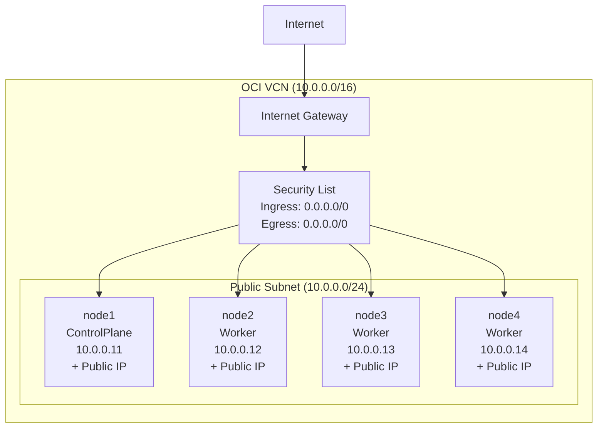

## 當前網路架構



## OCI 驗證
```sh
# 重新設定config
oci setup config
vi ~/.oci/config
rm ~/.oci/config
oci session authenticate
```

## 敏感文件處理

### 重要：以下文件包含敏感資訊，不會被上傳到版本控制系統：

| 文件 | 說明 | 處理方式 |
|------|------|----------|
| `ap-osaka-1` | OCI 配置文件 | 複製 `ap-osaka-1.example` 並填入你的實際配置 |
| `id_rsa` | SSH 私鑰 | 由 Terraform 自動生成，每次部署都會重新生成 |
| `id_rsa.pub` | SSH 公鑰 | 由 Terraform 自動生成，每次部署都會重新生成 |
| `kubeconfig` | Kubernetes 配置 | 由 Terraform 自動生成，包含集群認證資訊 |

### 設置步驟：
1. 複製範例配置文件：`cp ap-osaka-1.example ap-osaka-1`
2. 編輯配置文件：`vi ap-osaka-1`
3. 填入你的實際 OCI 配置資訊
4. 運行 `terraform apply` 生成其他必要文件


### 網路配置詳情

| 組件 | 配置 | 說明 |
|------|------|------|
| **VCN** | 10.0.0.0/16 | 虛擬雲網路範圍 |
| **Subnet** | 10.0.0.0/24 | 公共子網（可分配 Public IP） |
| **Internet Gateway** | 已配置 | 提供網際網路連接 |
| **Security List** | 開放所有流量 | 允許所有入站和出站流量 |
| **節點 IP** | 10.0.0.11-14 | 靜態分配的私有 IP |
| **Public IP** | 自動分配 | 每個節點都有公共 IP |

### 節點配置

| 節點 | 角色 | 私有 IP | 公共 IP | 說明 |
|------|------|---------|---------|------|
| node1 | ControlPlane | 10.0.0.11 | 自動分配 | Kubernetes 控制平面 |
| node2 | Worker | 10.0.0.12 | 自動分配 | 工作節點 |
| node3 | Worker | 10.0.0.13 | 自動分配 | 工作節點 |
| node4 | Worker | 10.0.0.14 | 自動分配 | 工作節點 |

### 重要說明

- **子網類型**：當前使用 **Public Subnet**，所有節點都可以直接訪問網際網路
- **安全性**：Security List 目前開放所有流量，生產環境建議限制
- **IP 分配**：每個節點都有靜態私有 IP 和動態公共 IP
- **可用性域**：所有節點部署在同一個可用性域中

## Steps
1. Create an Oracle Cloud Infrastructure account (just follow this link).
2. Have installed or install kubernetes.
3. Have installed or install terraform.
4. Have installed or install OCI CLI .
5. Configure OCI credentials. If you obtain a session token (with oci session authenticate), make sure to put the correct region, and when prompted for the profile name, enter DEFAULT so that Terraform finds the session token automatically.
6. Download this project and enter its folder.
7. `terraform init`
8. `terraform apply`


## Reference
`https://github.com/jpetazzo/ampernetacle`

## Applying OKE Planning

### 從單機實例轉換到 OKE (Oracle Container Engine for Kubernetes) 需要調整的項目清單：

#### 1. 主要資源變更

| 操作 | 資源類型 | 說明 |
|------|----------|------|
| 移除 | `oci_core_instance` | main.tf 中的虛擬機實例 |
| 新增 | `oci_container_engine_cluster` | OKE 集群 |
| 新增 | `oci_container_engine_node_pool` | 節點池 |

#### 2. 網路配置調整

| 操作 | 組件 | 說明 |
|------|------|------|
| 保留 | VCN, Internet Gateway, Route Table, Security List, Subnet | 基礎網路架構保持不變 |
| 新增 | 負載均衡器子網 | 可能需要額外的子網用於負載均衡器 |
| 調整 | Security List 規則 | 針對 Kubernetes 服務進行優化 |

#### 3. 變量調整 (variables.tf)

| 操作 | 原變量 | 新變量 | 說明 |
|------|--------|--------|------|
| 保留 | `name` | `name` | 資源名稱 |
| 保留 | `availability_domain` | `availability_domain` | 可用性域 |
| 調整 | `shape` | `node_pool_shape` | 節點池形狀 |
| 調整 | `how_many_nodes` | `node_pool_size` | 節點池大小 |
| 調整 | `ocpus_per_node` | `node_pool_ocpus` | 節點 OCPU |
| 調整 | `memory_in_gbs_per_node` | `node_pool_memory` | 節點記憶體 |
| 新增 | - | `kubernetes_version` | Kubernetes 版本 |
| 新增 | - | `node_pool_name` | 節點池名稱 |

#### 4. 移除的組件

| 文件/組件 | 說明 |
|-----------|------|
| `cloudinit.tf` | OKE 會自動處理節點初始化 |
| `sshkey.tf` | OKE 會自動生成 SSH 金鑰 |
| TLS 私鑰相關資源 | 不再需要手動管理 |
| kubeadm 相關配置和腳本 | OKE 自動處理集群初始化 |

#### 5. 新增的組件

| 組件 | 說明 |
|------|------|
| OKE 集群配置 | 定義 Kubernetes 集群 |
| 節點池配置 | 定義工作節點池 |
| Kubernetes 配置輸出 | 生成 kubeconfig |

#### 6. 輸出調整 (outputs.tf)

| 操作 | 輸出項目 | 說明 |
|------|----------|------|
| 移除 | 實例相關輸出 | 不再需要實例 IP 等資訊 |
| 新增 | OKE 集群 ID | 集群識別碼 |
| 新增 | 節點池 ID | 節點池識別碼 |
| 新增 | Kubernetes 配置 | kubeconfig 內容 |

#### 7. 注意事項

| 項目 | 說明 |
|------|------|
| 網路配置 | OKE 需要額外的網路配置用於負載均衡器 |
| IAM 策略 | 可能需要調整 IAM 策略以支援 OKE 操作 |
| 成本評估 | 成本可能會有所不同，需要評估 |
| 自定義配置 | 某些自定義配置可能需要通過 OKE 的配置選項實現 |

## Applying GKE Planning

### 從單機實例轉換到 GKE (Google Kubernetes Engine) 需要調整的項目清單：

#### 1. 主要資源變更

| 操作 | 資源類型 | 說明 |
|------|----------|------|
| 移除 | `oci_core_instance` | 移除 OCI 虛擬機實例 |
| 新增 | `google_container_cluster` | GKE 集群 |
| 新增 | `google_container_node_pool` | GKE 節點池 |

#### 2. 網路配置調整

| 操作 | 組件 | 說明 |
|------|------|------|
| 移除 | OCI VCN, Internet Gateway, Route Table, Security List, Subnet | 移除 OCI 網路組件 |
| 新增 | `google_compute_network` | GCP VPC 網路 |
| 新增 | `google_compute_subnetwork` | GCP 子網 |
| 新增 | `google_compute_firewall` | GCP 防火牆規則 |
| 新增 | `google_compute_router` | Cloud Router |
| 新增 | `google_compute_router_nat` | Cloud NAT |

#### 3. 變量調整 (variables.tf)

| 操作 | 原變量 | 新變量 | 說明 |
|------|--------|--------|------|
| 保留 | `name` | `name` | 資源名稱 |
| 移除 | `availability_domain` | - | GCP 不需要可用性域 |
| 調整 | `shape` | `machine_type` | GCP 機器類型 |
| 調整 | `how_many_nodes` | `node_count` | 節點數量 |
| 調整 | `ocpus_per_node` | - | GCP 機器類型已包含 CPU |
| 調整 | `memory_in_gbs_per_node` | - | GCP 機器類型已包含記憶體 |
| 新增 | - | `project_id` | GCP 專案 ID |
| 新增 | - | `region` | GCP 區域 |
| 新增 | - | `zone` | GCP 可用區 |
| 新增 | - | `kubernetes_version` | Kubernetes 版本 |

#### 4. 移除的組件

| 文件/組件 | 說明 |
|-----------|------|
| `cloudinit.tf` | GKE 會自動處理節點初始化 |
| `sshkey.tf` | GKE 會自動生成 SSH 金鑰 |
| `network.tf` | 需要重寫為 GCP 網路配置 |
| `providers.tf` | 需要改為 Google Provider |
| TLS 私鑰相關資源 | 不再需要手動管理 |
| kubeadm 相關配置和腳本 | GKE 自動處理集群初始化 |

#### 5. 新增的組件

| 組件 | 說明 |
|------|------|
| Google Provider 配置 | 設定 GCP 認證和專案 |
| GKE 集群配置 | 定義 Kubernetes 集群 |
| GKE 節點池配置 | 定義工作節點池 |
| GCP 網路配置 | VPC、子網、防火牆 |
| Kubernetes 配置輸出 | 生成 kubeconfig |

#### 6. 輸出調整 (outputs.tf)

| 操作 | 輸出項目 | 說明 |
|------|----------|------|
| 移除 | 實例相關輸出 | 不再需要實例 IP 等資訊 |
| 新增 | GKE 集群 ID | 集群識別碼 |
| 新增 | 節點池 ID | 節點池識別碼 |
| 新增 | Kubernetes 配置 | kubeconfig 內容 |
| 新增 | GCP 網路資訊 | VPC、子網等網路資訊 |

#### 8. 注意事項

| 項目 | 說明 |
|------|------|
| 認證配置 | 需要設定 GCP Service Account 或 gcloud 認證 |
| 網路配置 | GKE 需要特定的 VPC 和子網配置 |
| IAM 權限 | 需要適當的 GCP IAM 權限 |
| 成本評估 | GKE 定價模式與 OCI 不同，需要評估 |
| 區域選擇 | 需要選擇合適的 GCP 區域和可用區 |
| 自定義配置 | 某些自定義配置可能需要通過 GKE 的配置選項實現 |